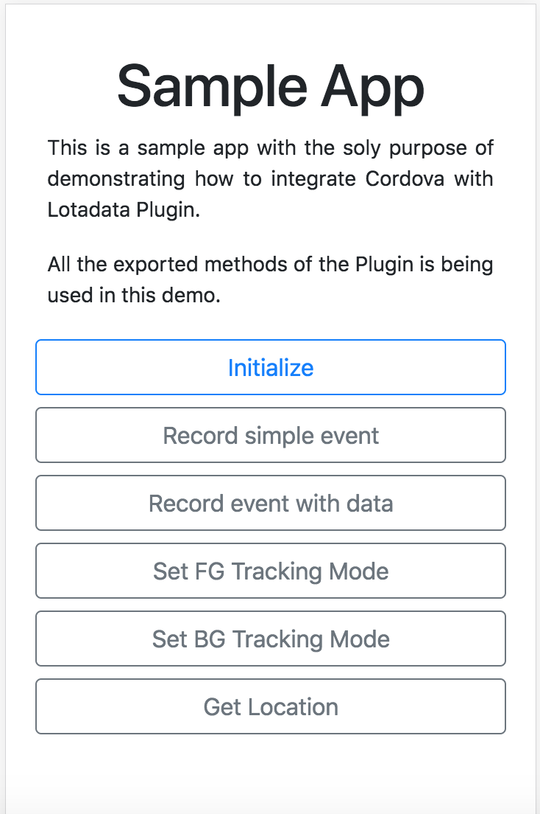

Sample Cordova App
---

The idea behind the app is simple: Show off how to integrate Lotadata Cordova Plugin with an app.



#### 1. Add the Android platform to the project
```
$ cordova platform add android
```

#### 2. Add Lotadadata Cordova Plugin
This sample repository doesn't come with the plugin added to it. We want you to manually install it:
```
$ cordova plugin add https://github.com/LotaData-Inc/cordova-plugin-lotadata-sdk.git#<version>
```

Check out available versions: https://github.com/LotaData-Inc/cordova-plugin-lotadata-sdk/tags

#### 3. Run it
Make sure you have a connected device or emulator at this point.
```
$ cordova run
```
